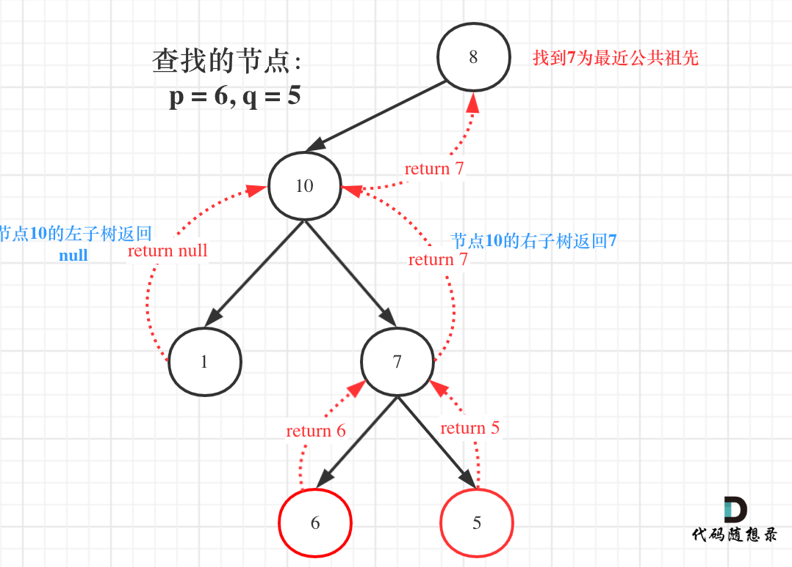

# [236. 二叉树的最近公共祖先](https://leetcode.cn/problems/lowest-common-ancestor-of-a-binary-tree/)

给定一个二叉树, 找到该树中两个指定节点的最近公共祖先。

[百度百科](https://baike.baidu.com/item/最近公共祖先/8918834?fr=aladdin)中最近公共祖先的定义为：“对于有根树 T 的两个节点 p、q，最近公共祖先表示为一个节点 x，满足 x 是 p、q 的祖先且 x 的深度尽可能大（**一个节点也可以是它自己的祖先**）。”

 

**示例 1：**


```
输入：root = [3,5,1,6,2,0,8,null,null,7,4], p = 5, q = 1
输出：3
解释：节点 5 和节点 1 的最近公共祖先是节点 3 。
```

**示例 2：**


```
输入：root = [3,5,1,6,2,0,8,null,null,7,4], p = 5, q = 4
输出：5
解释：节点 5 和节点 4 的最近公共祖先是节点 5 。因为根据定义最近公共祖先节点可以为节点本身。
```

**示例 3：**

```
输入：root = [1,2], p = 1, q = 2
输出：1
```

 

**提示：**

- 树中节点数目在范围 `[2, 105]` 内。
- `-109 <= Node.val <= 109`
- 所有 `Node.val` `互不相同` 。
- `p != q`
- `p` 和 `q` 均存在于给定的二叉树中。

## 思路

遇到这个题目首先想的是要是能自底向上查找就好了，这样就可以找到公共祖先了。

那么二叉树如何可以自底向上查找呢？

回溯啊，二叉树回溯的过程就是从低到上。

后序遍历就是天然的回溯过程，最先处理的一定是叶子节点。

接下来就看如何判断一个节点是节点q和节点p的公共公共祖先呢。

**如果找到一个节点，发现左子树出现结点p，右子树出现节点q，或者 左子树出现结点q，右子树出现节点p，那么该节点就是节点p和q的最近公共祖先。**

使用后序遍历，回溯的过程，就是从低向上遍历节点，一旦发现如何这个条件的节点，就是最近公共节点了。

- 确定终止条件

如果找到了 节点p或者q，或者遇到空节点，就返回。

代码如下：

```java
if (root == q || root == p || root == null) return root;
```

**如果left 和 right都不为空，说明此时root就是最近公共节点。这个比较好理解**

**如果left为空，right不为空，就返回right，说明目标节点是通过right返回的，反之依然**。

这里有的同学就理解不了了，为什么left为空，right不为空，目标节点通过right返回呢？

如图：



图中节点10的左子树返回null，右子树返回目标值7，那么此时节点10的处理逻辑就是把右子树的返回值（最近公共祖先7）返回上去！

## 解法

```java
class Solution {
    public TreeNode lowestCommonAncestor(TreeNode root, TreeNode p, TreeNode q) {
        if (root == null || root == p || root == q) {
            return root;
        }
        TreeNode left = lowestCommonAncestor(root.left, p, q);
        TreeNode right = lowestCommonAncestor(root.right, p, q);
        if (left != null && right != null) {
            return root;
        }
        if (left != null) {
            return left;
        }
        return right;
    }
}
```

