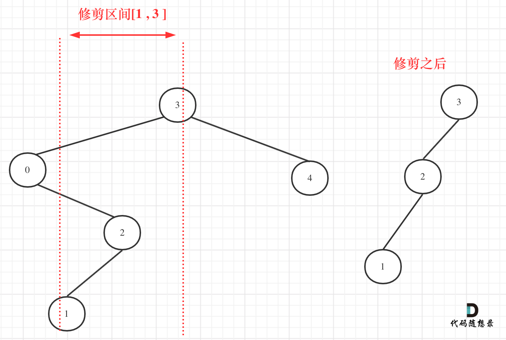

# [669. 修剪二叉搜索树](https://leetcode.cn/problems/trim-a-binary-search-tree/)

给你二叉搜索树的根节点 `root` ，同时给定最小边界`low` 和最大边界 `high`。通过修剪二叉搜索树，使得所有节点的值在`[low, high]`中。修剪树不应该改变保留在树中的元素的相对结构（即，如果没有被移除，原有的父代子代关系都应当保留）。 可以证明，存在唯一的答案。

所以结果应当返回修剪好的二叉搜索树的新的根节点。注意，根节点可能会根据给定的边界发生改变。

**示例 1：**


```
输入：root = [1,0,2], low = 1, high = 2
输出：[1,null,2]
```

**示例 2：**


```
输入：root = [3,0,4,null,2,null,null,1], low = 1, high = 3
输出：[3,2,null,1]
```

**示例 3：**

```
输入：root = [1], low = 1, high = 2
输出：[1]
```

**示例 4：**

```
输入：root = [1,null,2], low = 1, high = 3
输出：[1,null,2]
```

**示例 5：**

```
输入：root = [1,null,2], low = 2, high = 4
输出：[2]
```

**提示：**

- 树中节点数在范围 `[1, 104]` 内
- `0 <= Node.val <= 104`
- 树中每个节点的值都是唯一的
- 题目数据保证输入是一棵有效的二叉搜索树
- `0 <= low <= high <= 104`

## 思路

直接想法就是：递归处理，然后遇到 `root->val < low || root->val > high` 的时候直接return null，但是这样是有问题的。

如下图，**[1, 3]区间在二叉搜索树的中可不是单纯的节点3和左孩子节点0就决定的，还要考虑节点0的右子树**。



所以直接返回null是不行的。

在上图中我们发现节点0并不符合区间要求，那么将节点0的右孩子 节点2 直接赋给 节点3的左孩子就可以了（就是把节点0从二叉树中移除），如图：


## 解法

### 递归

```java
class Solution {
    public TreeNode trimBST(TreeNode root, int low, int high) {
        if (root == null) {
            return null;
        }
        //如果root（当前节点）的元素小于low的数值，那么应该递归右子树，并返回右子树符合条件的头结点。
        if (root.val < low) {
            TreeNode right = trimBST(root.right, low, high);
            return right;
        }
        //如果root(当前节点)的元素大于high的，那么应该递归左子树，并返回左子树符合条件的头结点。
        if (root.val > high) {
            TreeNode left = trimBST(root.left, low, high);
            return left;
        }
        //将下一层处理完左子树的结果赋给root->left，处理完右子树的结果赋给root->right。
        root.left = trimBST(root.left, low, high);
        root.right = trimBST(root.right, low, high);
        return root;
    }
}
```

### 迭代

因为二叉搜索树的有序性，不需要使用栈模拟递归的过程。

在剪枝的时候，可以分为三步：

- 将root移动到[L, R] 范围内，注意是左闭右闭区间
- 剪枝左子树
- 剪枝右子树

```java
class Solution {
    public TreeNode trimBST(TreeNode root, int low, int high) {
        if (root == null) {
            return null;
        }
        //处理头结点
        while (root != null && (root.val < low || root.val > high)) {
            if (root.val < low) {
                root = root.right;
            } else {
                root = root.left;
            }
        }
        if (root == null) {
            return null;
        }
        //保存头结点
        TreeNode cur = root;
        //处理左子树。此时头结点已处理过，所以必定在 [low, high] 范围内，所以只需要判断左子树节点不能小于 low 即可
        while (cur.left != null) {
            if (cur.left.val >= low) {
                cur = cur.left;
            } else {
                cur.left = cur.left.right;
            }
        }
        cur = root;
        //处理右子树。此时头结点已处理过，所以必定在 [low, high] 范围内，所以只需要判断右子树节点不能大于 high 即可
        while (cur.right != null) {
            if (cur.right.val <= high) {
                cur = cur.right;
            } else {
                cur.right = cur.right.left;
            }
        }
        return root;
    }
}
```

