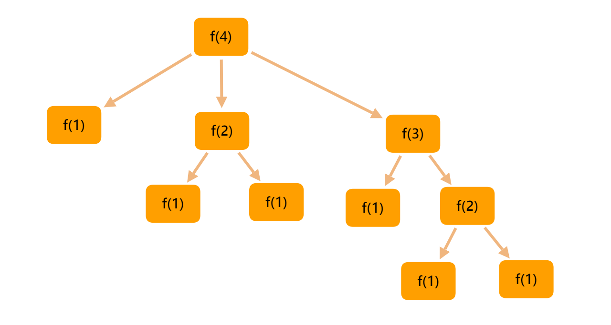

# 377. 组合总和 Ⅳ

[题目链接](https://leetcode.cn/problems/combination-sum-iv/description/)

给你一个由 **不同** 整数组成的数组 `nums` ，和一个目标整数 `target` 。请你从 `nums` 中找出并返回总和为 `target` 的元素组合的个数。

题目数据保证答案符合 32 位整数范围。

**示例 1：**

```
输入：nums = [1,2,3], target = 4
输出：7
解释：
所有可能的组合为：
(1, 1, 1, 1)
(1, 1, 2)
(1, 2, 1)
(1, 3)
(2, 1, 1)
(2, 2)
(3, 1)
请注意，顺序不同的序列被视作不同的组合。
```

**示例 2：**

```
输入：nums = [9], target = 3
输出：0
```

**提示：**

- `1 <= nums.length <= 200`
- `1 <= nums[i] <= 1000`
- `nums` 中的所有元素 **互不相同**
- `1 <= target <= 1000`

**进阶：**如果给定的数组中含有负数会发生什么？问题会产生何种变化？如果允许负数出现，需要向题目中添加哪些限制条件？

## 解法

### 1. 递归

对于`nums = [1,2,3], target = 4`，假设

第一位选择 `num[0]` 时则有 `f(4 - 1) = f(3)` 种情况，

第一位选择 `num[1]` 时则有 `f(4 - 2) = f[2)` 中情况，

第一位选择 `num[2]` 时则有 `f(4 - 3) = f(1)` 中情况。

所以`f(target) = f(target - num[0]) + f(target - num[1]) + ... + f(target - num[n - 1])`

即：
$$
f[target] = \sum_{i=0}^{n - 1}{f[target - nums[i]]}
$$


```java
class Solution {
    public int combinationSum4(int[] nums, int target) {
        if (target == 0) {
            return 1;
        }
        if (target < 0) {
            return 0;
        }
        int res = 0;
        for (int i = 0; i < nums.length; i++) {
            res += combinationSum4(nums, target - nums[i]);
        }
        return res;
    }
}
```

递归效率较差，即使加上记忆化搜索在target比较大时还是会出现超时。

### 2. 动态规划

递归是自顶向下的，动态规划是自底向上的。递归时我们只关注 `f(target - nums[i])`有多少种情况即可，动态规划却需要从 `f(0)`开始一直迭代到 `f(target)`，所以设 `dp[i]`为 `target`为 `i`时的组合数量（是不是就是完全背包了），那么由于 $$f(target) = \sum_{i=0}^{n - 1}{f(target - nums[i])}$$，所以

$$
\begin{align*}
& dp[0] = f(0) = \sum_{i=0}^{n - 1}{f(0 - nums[i])},\\
& dp[1] = f(1) = \sum_{i=0}^{n - 1}{f(1 - nums[i])},\\
& \dots \\
& dp[target] = f(target) = \sum_{i=0}^{n - 1}{f(target - nums[i])}
& \end{align*}
$$
递归公式为完全背包的累加，只不过要先遍历 target 再遍历背包，和一般写法正好反过来。

但是 `dp[0]` 要初始化为 1，没有实际意义，只是计算需要。

```java
class Solution {
    public int combinationSum4(int[] nums, int target) {
        if (target < 0) {
            return 0;
        }
        int res = 0;
        int[] dp = new int[target + 1];
        dp[0] = 1;
        for (int i = 0; i <= target; i++) {
            for (int j = 0; j < nums.length; j++) {
                if (i - nums[j] >= 0) {
                    dp[i] += dp[i - nums[j]];
                }
            }
        }
        return dp[target];
    }
}
```
